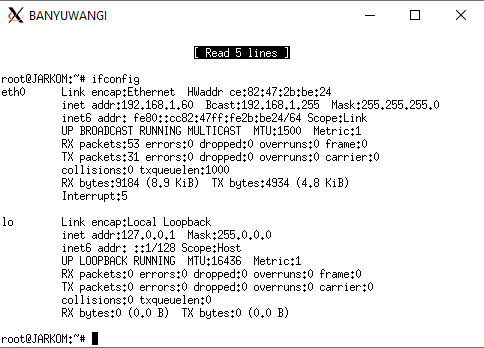
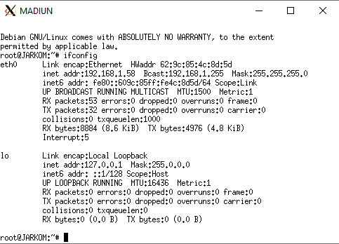

# Jarkom_Modul3_Lapres_A02
Lapres Jarkom Modul 3 (DHCP dan Proxy Server)

# A02
  - Btari Aliya Tsabitah      (05111840000012)
  - Emmanuel Maximus Yohanes  (05111840000102)
  
## Soal 1
Membuat topologi jaringan.

### Jawab
~~~
uml_switch -unix switch1 > /dev/null < /dev/null &
uml_switch -unix switch2 > /dev/null < /dev/null &
uml_switch -unix switch3 > /dev/null < /dev/null &

xterm -T SURABAYA -e linux ubd0=SURABAYA,jarkom umid=SURABAYA eth0=tuntap,,,10.151.72.13 eth1=daemon,,,switch1 eth2=daemon,,,switch3 eth3=daemon,,,swith2 mem=256M &

# Kiri = eth1, switch1
xterm -T GRESIK -e linux ubd0=GRESIK,jarkom umid=GRESIK eth0=daemon,,,switch1 mem=64M &
xterm -T SIDOARJO -e linux ubd0=SIDOARJO,jarkom umid=SIDOARJO eth0=daemon,,,switch1 mem=64M &

# Kanan = eth2, switch3
xterm -T BANYUWANGI -e linux ubd0=BANYUWANGI,jarkom umid=BANYUWANGI eth0=daemon,,,switch3 mem=64M &
xterm -T MADIUN -e linux ubd0=MADIUN,jarkom umid=MADIUN eth0=daemon,,,switch3 mwm=64M &

# Bawah = eth3, switch2
xterm -T MALANG -e linux ubd0=MALANG,jarkom umid=MALANG eth0=daemon,,,switch2 mem=160M &
xterm -T MOJOKERTO -e linux ubd0=MOJOKERTO,jarkom umid=MOJOKERTO eth0=daemon,,,switch2 mem=128M &
xterm -T TUBAN -e linux ubd0=TUBAN,jarkom umid=TUBAN eth0=daemon,,,switch2 mem=128M &
~~~

## DHCP
## Soal 2
SURABAYA ditunjuk sebagai perantara (DHCP Relay) antara DHCP Server dan client.

### Jawab
  1. Install isc-dhcp-relay di SURABAYA.
  2. Menambahkan IP TUBAN pada SERVERS di file /etc/default/isc-dhcp-relay sehingga menjadi `SERVERS="10.151.73.28"` dan mengosongkan INTERFACES `INTERFACES=""`
  3. Install isc-dhcp-server di TUBAN.
  4. Mengosongkan INTERFACES pada file /etc/default/isc-dhcp-server TUBAN sehingga menjadi `INTERFACES=""`
  5. Melakukan konfigurasi DHCP berikut pada file /etc/dhcp/dhcpd.conf di TUBAN
      ~~~
      subnet 10.151.73.24 netmask 255.255.255.248 {
          range 10.151.73.26 10.151.73.30;
          option routers 10.151.73.25;
          option broadcast-address 10.151.73.31;
      }
      ~~~
      Keterangan:
        - Subnet merupakan NID DMZ kelompok A02. 
        - IP gateway pada option routers menggunakan eth3 SURABAYA.
        - IP broadcast merupakan IP terakhir dari subnet.
  6. Mengubah konfigurasi interfaces SURABAYA (file /etc/network/interfaces).
      ~~~
      auto eth0
      iface eth0 inet static
      address 10.151.72.14
      netmask 255.255.255.252
      gateway 10.151.72.13

      auto eth1
      iface eth1 inet static
      address 192.168.0.1
      netmask 255.255.255.0

      auto eth2
      iface eth2 inet static
      address 192.168.1.1
      netmask 255.255.255.0

      auto eth3
      iface eth3 inet static
      address 10.151.73.25
      netmask 255.255.255.248
      ~~~

## Soal 3, 4, 5, 6
### Soal 3 
Client pada subnet 1 mendapatkan range IP dari 192.168.0.10 sampai 192.168.0.100 dan 192.168.0.110 sampai 192.168.0.200.
### Soal 4
Client pada subnet 3 mendapatkan range IP dari 192.168.1.50 sampai 192.168.1.70.
### Soal 5
Client mendapatkan DNS Malang dan DNS 202.46.129.2 dari DHCP.
### Soal 6
Client di subnet 1 mendapatkan peminjaman alamat IP selama 5 menit, sedangkan (6) client pada subnet 3 mendapatkan peminjaman IP selama 10 menit.

### Jawab
  1. Menambahkan konfigurasi berikut pada file /etc/dhcp/dhcpd.conf TUBAN.
      - Subnet 1
          ~~~
          subnet 192.168.0.0 netmask 255.255.255.0 {
              range 192.168.0.10 192.168.0.100;
              range 192.168.0.110 192.168.0.200;
              option routers 192.168.0.1;
              option broadcast-address 192.168.0.255;
              option domain-name-servers 10.151.73.26, 202.46.129.2;
              option domain-name "";
              default-lease-time 300;
              max-lease-time 300;
          }
          ~~~
          Keterangan:
          - Range seperti yang diminta pada soal yaitu 192.168.0.10 sampai 192.168.0.100 dan 192.168.0.110 sampai 192.168.0.200.
          - Routers berisi IP gateway dari router menuju subnet 1 sehingga diisi eth1 SURABAYA.
          - Broadcast-address adalah IP terakhir dari subnet.
          - Pada soal 4, client diminta untuk mendapatkan DNS Malang dan DNS 202.46.129.2 maka dari itu domain-name-servers berisi IP MALANG (10.151.73.26) dan 202.46.129.2
          - Sesuai dengan soal 6, client pada subnet 1 mendapatkan peminjaman IP selamat 5 menit sehingga default-lease-time dan max-lease-time diisi 300 (detik).
      - Subnet 3
          ~~~
          subnet 192.168.1.0 netmask 255.255.255.0 {
              range 192.168.1.50 192.168.1.70;
              option routers 192.168.1.1;
              option broadcast-address 192.168.1.255;
              option domain-name-servers 10.151.73.26, 202.46.129.2;
              option domain-name "";
              default-lease-time 600;
              max-lease-time 600;
          }
          ~~~
          Keterangan:
          - Range seperti yang diminta pada soal yaitu 192.168.1.50 sampai 192.168.1.70 
          - Routers berisi IP gateway dari router menuju subnet 3 sehingga diisi eth2 SURABAYA.
          - Broadcast-address adalah IP terakhir dari subnet.
          - Pada soal 4, client diminta untuk mendapatkan DNS Malang dan DNS 202.46.129.2 maka dari itu domain-name-servers berisi IP MALANG (10.151.73.26) dan 202.46.129.2
          - Sesuai dengan soal 6, client pada subnet 3 mendapatkan peminjaman IP selamat 10 menit sehingga default-lease-time dan max-lease-time diisi 600 (detik).
  2. Menghapus konfigurasi interface lama (konfigurasi IP statis) pada semua client, lalu menambahkan syntax berikut.
  ~~~
  auto eth0
  iface eth0 inet dhcp
  ~~~

  #### Testing
  - Subnet 1
    - GRESIK

      
      
      
    - SIDOARJO
    
      
      
     
  - Subnet 3
    - BANYUWANGI
    
      
      
    
    - MADIUN
      
      
      
## Proxy
Semua konfigurasi Proxy nomor 7-11 dilakukan di MOJOKERTO.
## Soal 7
Proxy memiliki User autentikasi dengan format:
User : userta_a02
Password : inipassw0rdta_a02

### Jawab
  1. Membuat user dan password baru menggunakan htpasswd dengan cara menjalankan command sebagai berikut.
      ~~~
      htpasswd -c /etc/squid3/passwd userta_a02
      ~~~
      Setelah itu mengetikkan passwordnya yaitu `inipassw0rdta_a02`
      File passwd akan berisi seperti ini.

      

  2. Mengubah konfigurasi squid pada file /etc/squid3/squid.conf
      ~~~
      http_port 8080
      visible_hostname mojokerto

      auth_param basic program /usr/lib/squid3/ncsa_auth /etc/squid/passwd
      auth_param basic children 5
      auth_param basic realm Proxy
      auth_param basic credentialsttl 2 hours
      auth_param basic casesensitive on
      acl USERS proxy_auth REQUIRED
      http_access deny !USERS
      http_access allow all
      ~~~
      Keterangan:
        - `http_access deny !USERS` artinya melarang akses dari yang bukan USERS
        - `http_access allow all` artinya membolehkan akses USERS
        
#### Testing

  

## Soal 8 dan 9
Jaringan proxy hanya bisa diakses pada hari Selasa-Rabu pukul 13:00-18:00 dan Selasa-Kamis pukul 21.00 - 09.00 keesokan harinya (sampai Jumat jam 09.00).

### Jawab
  1. Membuat file acl.conf di folder squid3
  2. Menambahkan syntax berikut pada file tersebut.
      ~~~
      acl PENGERJAAN time TW 13:00-18:00
      acl BIMBINGAN1 time TWH 21:00-24:00
      acl BIMBINGAN2 time WHF 00:00-09:00
      ~~~
      Keterangan:
        - Waktu akses dibagi menjadi 3 yaitu **PENGERJAAN, BIMBINGAN1, dan BIMBINGAN2**.
        - **PENGERJAAN** yaitu waktu pengerjaan TA, hari Selasa-Rabu jam 13:00-18:0
        - Waktu bimbingan dibagi menjadi dua, yaitu **BIMBINGAN1** dan **BIMBINGAN2**. Di mana **BIMBINGAN1** adalah waktu pada hari Selasa, Rabu, dan Kamis jam 21:00-24:00 sedangkan **BIMBINGAN2** adalah waktu pada hari Rabu, Kamis, dan Jumat jam 00:00-09:00.
      
  3. Menambahkan konfigurasi berikut pada file squid.conf
      ~~~
      include /etc/squid3/acl.conf
      http_access deny !PENGERJAAN !BIMBINGAN1 !BIMBINGAN2
      ~~~
      Keterangan:
        - Memasukkan file acl.conf yang berisi waktu-waktu tadi.
        - `http_access deny !!PENGERJAAN !BIMBINGAN1 !BIMBINGAN2` artinya melarang akses yang bukan berada pada waktu-waktu tersebut.

#### Testing
  - Waktu pengerjaan
  
    - 
    - 
      
  - Waktu bimbingan
  
    - 
    - 
    - 
    - 
    
  - Di luar waktu akses
    

## Soal 10
Setiap mengakses google.com, maka akan di redirect menuju monta.if.its.ac.id

### Jawab
  1. Membuat file restrict-sites.acl di folder squid3
  2. Menambahkan `google.com` pada file tersebut.
      ~~~
      google.com
      ~~~
  3. Menambahkan konfigurasi berikut pada file squid.conf
      ~~~
      acl BLACKLIST dstdomain "/etc/squid3/restrict-sites.acl"
      deny_info http://monta.if.its.ac.id BLACKLIST
      http_reply_access deny BLACKLIST
      ~~~
      Keterangan:
        - Menambahkan acl BLACKLIST yang bertipe dstdomain yang didapatkan dari file `restrict-sites.acl`
        - `deny_info http://monta.if.its.ac.id BLACKLIST` artinya me-_redirect_ google.com ke http://monta.if.its.ac.id
        - `http_reply_access deny BLACKLIST` melarang akses google.com
        
## Konfigurasi squid akhir
~~~
http_port 8080
visible_hostname mojokerto
include /etc/squid3/acl.conf

auth_param basic program /usr/lib/squid3/ncsa_auth /etc/squid/passwd
auth_param basic children 5
auth_param basic realm Proxy
auth_param basic credentialsttl 2 hours
auth_param basic casesensitive on
acl USERS proxy_auth REQUIRED

http_access deny !PENGERJAAN !BIMBINGAN1 !BIMBINGAN2
http_access deny !USERS

acl BLACKLIST dstdomain "/etc/squid3/restrict-sites.acl"
deny_info http://monta.if.its.ac.id BLACKLIST
http_reply_access deny BLACKLIST

http_access allow all
~~~

## Soal 11
Mengubah error page default squid menjadi seperti gambar yang telah diberikan.

### Jawab
  1. Mendownload file yang telah diberikan dengan cara wget 10.151.36.202/ERR_ACCESS_DENIED pada folder /usr/share/squid3/errors/en
  2. Karena terdapat file dengan nama yang sama (yaitu file error page default squid), maka file hasil download tadi bernama ERR_ACCESS_DENIED.1 Sehingga, selanjutnya adalah menghapus file error page default squid (ERR_ACCESS_DENIED) dengan rm ERR_ACCESS_DENIED lalu merename ERR_ACCESS_DENIED.1 menjadi ERR_ACCESS_DENIED dengan cara `mv ERR_ACCESS_DENIED.1 ERR_ACCESS_DENIED`

## Soal 12
Ketika menggunakan proxy cukup dengan mengetikkan domain janganlupa-ta.yyy.pw dan memasukkan port 8080.

### Jawab
  1. Mengisi konfigurasi domain a02.pw pada file named.conf.local di folder /etc/bind pada MALANG.
      ~~~
      zone "a02.pw" {
          type master;
          file "/etc/bind/jarkom/a02.pw";
      }
      ~~~
  2. Membuat folder jarkom dalam /etc/bind
  3. meng-copy file db.local pada /etc/bind ke folder jarkom dengan nama a02.pw.
  4. Mengubah isi file /etc/bind/jarkom/a02.pw menjadi seperti berikut.
      ~~~
      ;
      ; BIND data file for local loopback interface
      ;
      $TTL    604800
      @       IN      SOA     a02.pw. root.a02.pw. (
                              2020112302      ; Serial
                              604800         ; Refresh
                              86400         ; Retry
                              2419200         ; Expire
                              604800 )       ; Negative Cache TTL
      ;
      @       IN      NS      a02.pw.
      @       IN      A       10.151.73.27
      janganlupa-ta   IN      A       10.151.73.27
      ~~~
      
  
  
   
